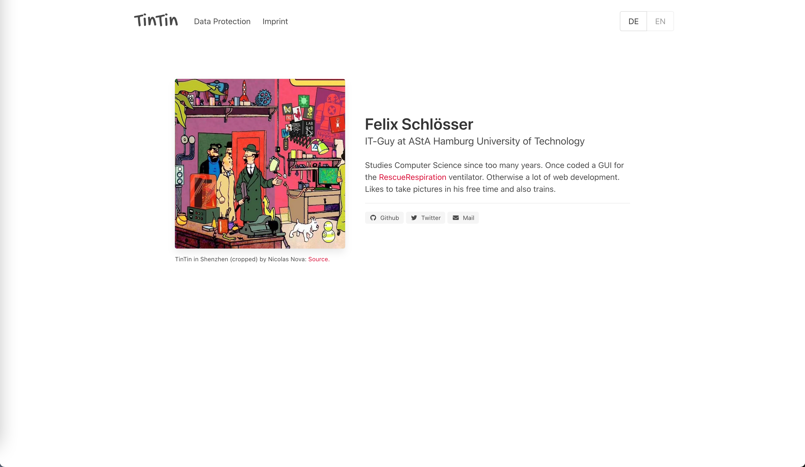

# Simple Personal Website based on the Zola Static Site generator



CSS Framewok used: [bulma](https://bulma.io/) with the addition of [bulma-prefers-dark](https://github.com/jloh/bulma-prefers-dark) to add support for Dark Mode.

## Contents

- [Translation](#translation)
- [Options](#options)
- [Known Issues](#known-issues)


## Translation

A lot of things can be tanslated via the translation settings inside the `config.toml`. All static text is ready for i18n. Dynamic text is translated usind special language specific endings inside the `content` directory. See the [zola docs](https://www.getzola.org/documentation/content/multilingual/) for more information on i18n.

```toml
[languages.en]
# Language specific settigns
title = "Felix Schlösser"
description = "A Hompage form and for TinTin"


[languages.en.translations]
occupation = "IT-Guy at AStA Hamburg University of Technology"
by = "by"
source = "Source"
source_code = "Source code"
licenced_under = "licenced under"
content_licenced_under = "Contents, unless stated otherwise, under"
powered_by = "Powered by"
zola_description = "a static site generator written in rust"
not_found_message = "Unfortunately this page could not be found."
back = "Back to the Homepage"
```

Additional Languages can easily be added:

```toml
[languages.de]
# Language specific settigns
title = "Felix Schlösser"
description = "Eine Hompage von und für TinTin."


[languages.de.translations]
occupation = "IT-Mensch im AStA der TU-Hamburg"
by = "von"
source = "Quelle"
source_code = "Quelltext"
licenced_under = "lizensiert unter der"
content_licenced_under = "Inhalte, wenn nicht anders angegeben, unter"
powered_by = "Erstellt mit"
zola_description = "einem in Rust geschriebenen statischen Seitengenerator"
not_found_message = "Diese Seite konnte leider nicht gefunden werden."
back = "Zurück zur Startseite"
```

## Options
A lot of things can be set via the extra settings inside the `config.toml`.

```toml
[extra]
# Put all your custom variables here
debug=true

brand_text = "Your Brand"

author_name = "John Appleseed"
author_nickname = "Jonny"
author_image="tintin_in_shenzhen.jpg"
city="Berlin"
copyright_year="2021"

image_path = "images/tintin_in_shenzhen.jpg"
image_alt = "Comic cover of TinTin entering a room full of bleeding edge technology with his friends."
image_title = "TinTin in Shenzhen (cropped)"
image_author = "Nicolas Nova"
image_link = "https://twitter.com/nicolasnova/status/1088082898404679680/photo/1"

source_code_link = "https://github.com/felixschloesser/website"

source_code_licence.name = "AGPL v3"
source_code_licence.link = "https://www.gnu.org/licenses/agpl-3.0.en.html"

content_licence.name = "CC BY-NC-SA 4.0"
content_licence. link = "https://creativecommons.org/licenses/by-nc-sa/4.0/"

social_links = [
    { url = "https://github.com/felixschloesser/", name="Github", icon = "fab fa-github"},
    { url = "https://twitter.com/TinTinUnbekannt", name="Twitter", icon = "fab fa-twitter"},
    { url = "mailto:info@felixschloesser.de", name="Mail", icon = "fas fa-envelope"}
]
```

If you put `$BASE_URL` in a url, it will automatically be replaced by the actual
site URL.


## Known Issues
The 404 cant be translated. This seems to be handles like a `wontfix` by the zola developers. See the relevant [issue discussion](https://github.com/getzola/zola/issues/821) for more details.
